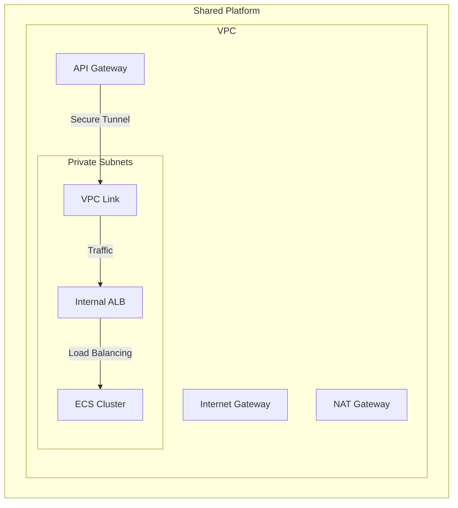

# AWS Fargate Platform Template

This repository contains the Terraform configuration for deploying the **Shared Platform** (VPC, ECS Cluster, ALB, API Gateway) that hosts your microservices.

## Architecture

This template deploys the foundational infrastructure that is **shared** across all microservices.

### Components
-   **VPC**: Isolated network with Public and Private subnets.
-   **ECS Cluster**: The compute plane where Fargate tasks run.
-   **Internal ALB**: Private load balancer not accessible from the internet.
-   **API Gateway & VPC Link**: The secure public entry point.

### Modular Deployment

The platform is designed to be modular. You can enable or disable specific components to save costs or tailor the environment to your needs (e.g., a "Lambda-only" environment).

| Feature | Default | Cost Impact | Description |
| :--- | :--- | :--- | :--- |
| **ECS Cluster** | `true` | Free | Required for Fargate services. Can be disabled for Lambda-only environments. |
| **ALB** | `true` | ~ $16/mo | Required for Fargate services. Can be disabled for Lambda-only environments. |
| **NAT Gateway** | `true` | ~ $32/mo | Required for private subnets to access the internet. |

## Usage (GitHub Actions)

This repository includes a CI/CD pipeline to deploy the platform automatically.

### 1. Configure Secrets & Variables
Go to **Settings > Secrets and variables > Actions** in your repository.

**Secrets:**
-   `AWS_OIDC_ROLE_ARN`: The ARN of the IAM Role for GitHub Actions (must trust this repo).

**Variables:**
-   `AWS_REGION`: e.g., `us-east-1`
-   `S3_STATE_BUCKET_NAME`: The S3 bucket for Terraform state (must exist).
-   `DYNAMODB_LOCK_TABLE`: The DynamoDB table for state locking (must exist).

### 2. Deploy via Workflow
1.  Go to the **Actions** tab.
2.  Select **Deploy Platform Infrastructure**.
3.  Click **Run workflow**.
4.  Select the target **environment** (`staging` or `prod`).
5.  (Optional) Configure **Feature Flags**:
    *   Uncheck **Enable ECS Cluster** if you don't need containers.
    *   Uncheck **Enable Application Load Balancer** to save costs.
    *   Uncheck **Enable NAT Gateway** if your private resources don't need internet access.

The workflow will:
*   Create environment-specific infrastructure (e.g., `acme-platform-staging-vpc`).
*   Store state at `platform/<environment>/terraform.tfstate`.

### 3. Destroy (Teardown)
To tear down the infrastructure, use the **Destroy Platform Infrastructure** workflow:
1.  Select the target **environment** to destroy.
2.  Type **DESTROY** to confirm.

## Outputs

After deployment, this module outputs the IDs required by your microservices:
-   `vpc_id`
-   `ecs_cluster_id`
-   `alb_listener_arn`
-   ...and more.

These outputs are stored in the remote state file, which the microservices read to plug themselves in.
